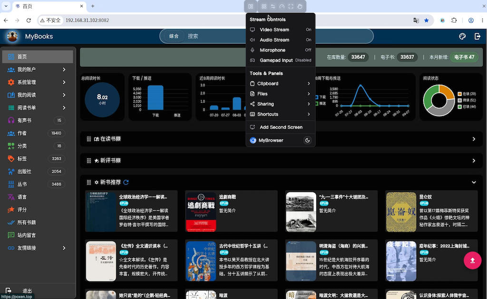
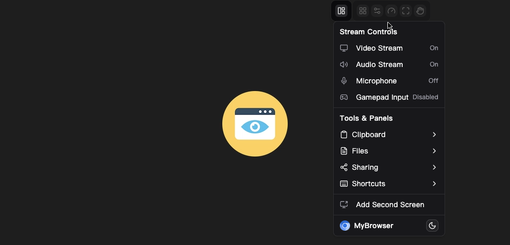
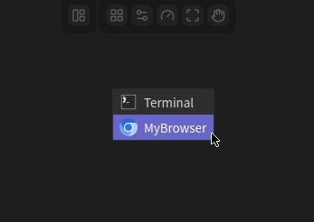

# [MyBrowser](https://github.com/poxenstudio/mybrowser)

[Chrome](https://www.google.com/chrome/) is the official web browser from Google, built to be fast, secure, and customizable.

[MyBrowser](https://poxen.top) is customized built from PoxenStudio, built to be simple for docker eco-system.

<p align="center">
  <a href="https://poxen.top/"></a>
</p>

优化的Chromium浏览器和自定义selkies UI，更适合NAS上部署使用。镜像构建基于linuxserver/google-chrome修改。

在NAS上部署浏览器后，有哪些作用：
* 通过反代在公网访问，提供终端工具, 可以访问局域网设备
* 配置执行一些网页自动化任务

集成的浏览器不是Chrome, 而是基于Chromium修改的版本。功能包括:
* 优化内存及显存占用
* 自定义的浏览器功能


## UI
连接后默认打开浏览器, 以打开书库服务为例：
<p align="center">
  </a>
</p>

关闭浏览器后有一个简易桌面:
<p align="center">
  </a>
</p>

右键菜单可以打开终端或者浏览器:
<p align="center">
  </a>
</p>

## 快速使用
推荐Docker compose部署。
```yaml
---
services:
  mybrowser:
    image: poxenstudio/mybrowser:latest
    container_name: mybrowser
    restart: unless-stopped
    ports:
      - "9001:3001"       # 不允许使用http端口3000, 直接绑定https端口
    volumes:
      - ./config:/config  # 用于存放项目配置文件，包括SSL证书等
      - ./data:/data      # 用于存放浏览器数据、扩展等数据的目录。将扩展上传到data目录就可以在浏览器安装
    shm_size: "2gb"
    environment:
      - PUID=1000
      - PGID=1000
      - CUSTOM_USER=admin  # 可选，打开时要求进行用户验证
      - PASSWORD=12456     # 可选，配合CUSTOM_USER, 输入密码才允许使用
      - CHROME_CLI='https://mybooks.top'   # 启动参数，可以指定打开的页面，也可以指定chrome command line参数
```


## 构建
```
make arm64 VERSION=1.0.0
make amd64 VERSION=1.0.0
```

运行一个容器进行测试:
```
docker run -d --name=mybrowser -p 3001:3001 --shm-size=2gb --restart unless-stopped poxenstudio/mybrowser:amd64-0.1.0
```

## 支持的架构

该镜像支持的架构如下：

| 架构      | 是否支持 | 标签                     |
| :----------: | :-------: | ----------------------- |
|    x86-64    |    ✅     | amd64-\<version tag\>   |
|    arm64     |    ❌     | arm64v8-\<version tag\> |


### 安全性

> [!WARNING]
> 此容器可对宿主系统进行特权访问。除非已妥善做好安全防护，否则请勿将其暴露到公网。

**完整功能需要 HTTPS 支持。** 用于视频和音频的 WebCodecs 等现代浏览器特性，在不安全的 HTTP 连接下无法正常工作。

### 全彩 4:4:4 编码

如果你发现文字模糊，尤其是黑色背景上的浅色文字，可以通过在侧边栏启用 **FullColor 4:4:4** 编码，或使用 jpeg 编码模式，向浏览器发送真正的 8 位色彩。

**关于硬件加速的说明：** 目前只有 Nvidia GPU 支持在 **零拷贝（Zero Copy）** 模式下对该色彩配置进行编码。如果在 Intel 或 AMD GPU 上启用了 FullColor 4:4:4，系统将回退到 CPU 编码。这会迫使 CPU 从 GPU 回读像素数据，从而导致性能大幅下降。

### 硬件加速与 Wayland

我们已将桌面容器从 X11 迁移到现代化的 Wayland 技术栈，目前已默认启用。

**硬件回退说明：** 在 `x86_64` 架构上，Wayland 技术栈需要处理器支持 AVX2（Intel Haswell 及更新一代）。如果你的处理器不支持 AVX2（例如较老的 CPU 或部分低端赛扬处理器），容器将自动回退到 X11。

**重要提示：** X11 的 GPU 加速支持已被弃用。未来硬件加速方面的开发将完全聚焦于 Wayland 技术栈。

如果你遇到兼容性问题，需要手动禁用 Wayland（强制回退到 X11），可以设置以下环境变量：

- `-e PIXELFLUX_WAYLAND=false`

**为什么选择 Wayland？**

- **零拷贝编码：** 在正确配置 GPU 的情况下，画面帧会直接在显卡上完成渲染和编码，全程无需拷贝到系统内存中。这能大幅降低 CPU 占用和延迟。
- **现代化技术栈：** 单应用容器使用 **Labwc**（取代 Openbox），完整桌面容器使用 **KDE Plasma Wayland**，在保持相同用户体验的同时，提供更现代、更高性能、更安全的合成渲染环境。

#### GPU 配置

在 Wayland 模式下使用硬件加速时，我们区分用于 **渲染**（3D 应用/桌面）和 **编码**（视频流）的显卡。

**配置变量：**

- `DRINODE`：用于 **渲染**（EGL）的 GPU 路径。
- `DRI_NODE`：用于 **编码**（VAAPI/NVENC）的 GPU 路径。

如果这两个变量指向同一设备，容器将自动启用 **零拷贝** 编码，显著降低 CPU 占用和延迟。如果它们指向不同设备，一个将用于 **渲染**，另一个将用于 **编码**（需经过 CPU 回读）。

你也可以使用环境变量 `AUTO_GPU=true`，设置后容器会自动使用检测到的第一块显卡（例如 `/dev/dri/renderD128`），并将其配置为 **零拷贝** 模式。

##### Intel 与 AMD（开源驱动）

适用于 Intel 和 AMD GPU。

```yaml
devices:
  - /dev/dri:/dev/dri
environment:
  - PIXELFLUX_WAYLAND=true
  # Optional: Specify device if multiple exist (IE: /dev/dri/renderD129)
  - DRINODE=/dev/dri/renderD128
  - DRI_NODE=/dev/dri/renderD128
```

##### Nvidia（专有驱动）

**注意：Nvidia 支持不适用于基于 Alpine 的镜像。**

**前提条件：**

1. **驱动：** 需要 **580 或更高版本** 的专有驱动。**务必使用从 Nvidia 官网直接下载的 `.run` 文件来安装驱动。**
   - **Unraid：** 请使用 Nvidia Driver 插件中的 production 分支。

2. **内核参数：** 必须在宿主机的引导加载程序中设置 `nvidia-drm.modeset=1 nvidia_drm.fbdev=1`。
   - **标准 Linux（GRUB）：** 编辑 `/etc/default/grub`，将该参数添加到已有的 `GRUB_CMDLINE_LINUX_DEFAULT` 行中：

     ```text
     GRUB_CMDLINE_LINUX_DEFAULT="<other existing options> nvidia-drm.modeset=1 nvidia_drm.fbdev=1"
     ```

     然后运行以下命令使更改生效：

     ```bash
     sudo update-grub
     ```

   - **Unraid（Syslinux）：** 编辑文件 `/boot/syslinux/syslinux.cfg`，在 Unraid OS 启动项的 `append` 行末尾添加 `nvidia-drm.modeset=1 nvidia_drm.fbdev=1`。

3. **硬件初始化：** **在无显示器（headless）系统上，Nvidia 显卡需要插入一个物理假负载头（dummy plug），DRM 才能正常初始化。**

4. **Docker 运行时：** 配置宿主机的 docker 守护进程以使用 Nvidia 运行时：

   ```bash
   sudo nvidia-ctk runtime configure --runtime=docker
   sudo systemctl restart docker
   ```

**Compose 配置：**

```yaml
---
services:
  mybrowser:
    image: poxenstudio/mybrowser:latest
    volumes:
      # user data and extensions
      - ./data:/data
    environment:
      - PIXELFLUX_WAYLAND=true
      # Ensure these point to the rendered node injected by the runtime (usually renderD128)
      - DRINODE=/dev/dri/renderD128
      - DRI_NODE=/dev/dri/renderD128
    deploy:
      resources:
        reservations:
          devices:
            - driver: nvidia
              count: 1
              capabilities: [compute, video, graphics, utility]
```

- **Unraid：** 请确保正确设置了 DRINODE/DRI_NODE，并在额外参数中添加 `--gpus all --runtime nvidia`。

### SealSkin 兼容性

此容器与 [SealSkin](https://sealskin.app) 兼容。

SealSkin 是一个自托管的客户端-服务器平台，提供安全的身份验证和协作功能，同时借助浏览器扩展拦截用户操作（例如点击链接或下载文件），并将其重定向到运行在远程服务器上的安全隔离应用环境中。

- **SealSkin 服务端：** [点此获取](https://github.com/linuxserver/docker-sealskin)
- **浏览器扩展：** [Chrome](https://chromewebstore.google.com/detail/sealskin-isolation/lclgfmnljgacfdpmmmjmfpdelndbbfhk)
- **移动应用：** [iOS](https://apps.apple.com/us/app/sealskin/id6758210210) 和 [Android](https://play.google.com/store/apps/details?id=io.linuxserver.sealskin)

### 所有基于 Selkies 的 GUI 容器的通用选项

此容器基于 [Docker Baseimage Selkies](https://github.com/linuxserver/docker-baseimage-selkies) 构建。

<details>
<summary>点击展开：可选环境变量</summary>

|      变量      | 说明                                                                                                                                                               |
| :----------------: | ------------------------------------------------------------------------------------------------------------------------------------------------------------------------- |
| PIXELFLUX_WAYLAND  | 如设为 true，容器将以 Wayland 模式初始化，运行 [Smithay](https://github.com/Smithay/smithay) 和 Labwc，并启用基于 GPU 的零拷贝编码 |
|  SELKIES_DESKTOP   | 如设为 true 且处于 Wayland 模式，将使用 labwc 初始化一个简易面板                                                                                         |
|    CUSTOM_PORT     | 容器用于监听 http 的内部端口，如需替换默认值 `3000` 时使用                                                                         |
| CUSTOM_HTTPS_PORT  | 容器用于监听 https 的内部端口，如需替换默认值 `3001` 时使用                                                                        |
|   CUSTOM_WS_PORT   | 容器用于监听 websocket 的内部端口，如需替换默认值 8082 时使用                                                                     |
|    CUSTOM_USER     | HTTP Basic 认证用户名，默认值为 abc。                                                                                                                                 |
|      DRI_NODE      | **编码用 GPU**：启用 VAAPI/NVENC 流编码，并使用指定的设备，例如 `/dev/dri/renderD128`                                                                |
|      DRINODE       | **渲染用 GPU**：指定用于 EGL/3D 加速的 GPU，例如 `/dev/dri/renderD129`                                                                              |
|      AUTO_GPU      | 如设为 true 且处于 Wayland 模式，将自动使用检测到的第一块可用 GPU 进行编码和渲染，例如 `/dev/dri/renderD128`                                 |
|      PASSWORD      | HTTP Basic 认证密码，默认值为 abc。若不设置则不启用认证                                                                                                  |
|     SUBFOLDER      | 若通过子目录进行反向代理，需要指定应用的子目录，前后都需带斜杠，例如 `/subfolder/`                                                                    |
|       TITLE        | 浏览器网页标题，默认值为 "Selkies"                                                                                                            |
|     DASHBOARD      | 允许用户设置自己的仪表盘。可选值：`selkies-dashboard`、`selkies-dashboard-zinc`、`selkies-dashboard-wish`                                                  |
| FILE_MANAGER_PATH  | 修改默认的上传/下载文件路径，该路径必须对 abc 用户拥有正确的权限                                                                            |
|    START_DOCKER    | 如设为 false，具有特权的容器将不会自动启动 DinD（Docker-in-Docker）设置                                                                             |
|    DISABLE_IPV6    | 如设为 true 或任意值，将禁用 IPv6                                                                                                                        |
|       LC_ALL       | 设置容器运行使用的语言，例如 `fr_FR.UTF-8`、`ar_AE.UTF-8`                                                                                               |
|      NO_DECOR      | 若设置，应用将不带窗口边框运行，可用于 PWA 场景。（可通过 Ctrl+Shift+d 启用/禁用窗口装饰）                                            |
|      NO_FULL       | 使用 openbox 时不自动将应用全屏显示。                                                                                                           |
|     NO_GAMEPAD     | 禁用用户空间的手柄拦截注入功能。                                                                                                                           |
|    DISABLE_ZINK    | 若检测到显卡，不设置 Zink 相关环境变量（用户空间应用将使用 CPU 渲染）                                                                     |
|    DISABLE_DRI3    | 若检测到显卡，不使用 DRI3 加速（用户空间应用将使用 CPU 渲染）                                                                  |
|      MAX_RES       | 为容器指定更大的最大分辨率，默认值为 16k（`15360x8640`）                                                                                            |
|   WATERMARK_PNG    | 容器内水印 png 图片的完整路径，例如 `/usr/share/selkies/www/icon.png`                                                                                    |
| WATERMARK_LOCATION | 水印在视频流中的绘制位置，可选整数值见下方说明                                                                                                            |
|   BACKGROUND_PNG   | **仅限 Wayland 模式。** 容器内桌面壁纸 png 图片的完整路径，显示在浏览器窗口背后。默认使用内置的 MyBrowser 背景图。         |

**`WATERMARK_LOCATION` 可选值：**

- **1**：左上
- **2**：右上
- **3**：左下
- **4**：右下
- **5**：居中
- **6**：动画

</details>

<details>
<summary>点击展开：可选的运行配置（DinD 与 GPU 挂载）</summary>

|                    参数                    | 说明                                                                                                                                                             |
| :--------------------------------------------: | ----------------------------------------------------------------------------------------------------------------------------------------------------------------------- |
|                 `--privileged`                 | 启动 Docker-in-Docker（DinD）环境。为获得更好性能，建议从宿主机挂载 Docker 数据目录，例如 `-v /path/to/docker-data:/var/lib/docker`。   |
| `-v /var/run/docker.sock:/var/run/docker.sock` | 挂载宿主机的 Docker socket，以便在容器内管理宿主机上的容器。                                                                                   |
|          `--device /dev/dri:/dev/dri`          | 将 GPU 挂载到容器中，可与 `DRINODE` 环境变量配合使用，利用宿主机显卡实现 GPU 加速应用。 |

</details>

<details>
<summary>点击展开：旧版 X11 分辨率与加速</summary>

**注意：** 本节内容仅适用于 **未** 使用 `PIXELFLUX_WAYLAND=true` 的情况。

在 X11 模式下通过 Nvidia DRM 或 DRI3 使用 3D 加速时，应将虚拟显示器限制在合理的最大分辨率范围内，以避免内存耗尽或性能不佳。

- `-e MAX_RES=3840x2160`

以上设置会将虚拟帧缓冲区的总分辨率设为 4K。默认情况下，虚拟显示器为 16K。如果你在加速的 X11 会话中遇到性能问题，可以尝试先将分辨率限制在 1080p，再逐步调高：

```bash
-e SELKIES_MANUAL_WIDTH=1920
-e SELKIES_MANUAL_HEIGHT=1080
-e MAX_RES=1920x1080
```

</details>

### 语言支持 - 国际化

要以其他语言启动桌面会话，请设置 `LC_ALL` 环境变量。例如：

- `-e LC_ALL=zh_CN.UTF-8` - 中文
- `-e LC_ALL=ja_JP.UTF-8` - 日语
- `-e LC_ALL=ko_KR.UTF-8` - 韩语
- `-e LC_ALL=ar_AE.UTF-8` - 阿拉伯语
- `-e LC_ALL=ru_RU.UTF-8` - 俄语
- `-e LC_ALL=es_MX.UTF-8` - 西班牙语（拉丁美洲）
- `-e LC_ALL=de_DE.UTF-8` - 德语
- `-e LC_ALL=fr_FR.UTF-8` - 法语
- `-e LC_ALL=nl_NL.UTF-8` - 荷兰语
- `-e LC_ALL=it_IT.UTF-8` - 意大利语

### 应用管理

在容器内安装应用有两种方式：PRoot 应用（推荐，可持久化）和原生应用。

#### PRoot 应用（可持久化）

以原生方式安装的软件包（例如通过 `apt-get install`）在容器重建后不会保留。为了在容器更新后仍保留应用及其设置，我们推荐使用 [proot-apps](https://github.com/linuxserver/proot-apps)。这些是安装到用户持久化 `$HOME` 目录下的便携式应用。

要安装应用，请在容器内使用命令行：

```bash
proot-apps install filezilla
```

支持的应用列表可在[这里](https://github.com/linuxserver/proot-apps?tab=readme-ov-file#supported-apps)查看。

#### 原生应用（不可持久化）

你可以使用 [universal-package-install](https://github.com/linuxserver/docker-mods/tree/universal-package-install) mod 从系统的原生软件源安装软件包。此方式会增加容器的启动时间，且不可持久化。请在 `compose.yaml` 中添加以下内容：

```yaml
environment:
  - DOCKER_MODS=linuxserver/mods:universal-package-install
  - INSTALL_PACKAGES=libfuse2|git|gdb
```

### 高级配置

<details>
<summary>点击展开：加固选项（Hardening Options）</summary>

以下变量可用于在单应用使用场景中锁定桌面环境，或限制用户的操作权限。

|       变量       | 说明                                                                                                                                                                                                                                                                     |
| :------------------: | ------------------------------------------------------------------------------------------------------------------------------------------------------------------------------------------------------------------------------------------------------------------------------- |
| **`HARDEN_DESKTOP`** | 启用 `DISABLE_OPEN_TOOLS`、`DISABLE_SUDO` 和 `DISABLE_TERMINALS`。如果用户未显式设置相关的 Selkies UI 选项（`SELKIES_FILE_TRANSFERS`、`SELKIES_COMMAND_ENABLED`、`SELKIES_UI_SIDEBAR_SHOW_FILES`、`SELKIES_UI_SIDEBAR_SHOW_APPS`），也会一并设置。 |
| **`HARDEN_OPENBOX`** | 启用 `DISABLE_CLOSE_BUTTON`、`DISABLE_MOUSE_BUTTONS` 和 `HARDEN_KEYBINDS`。如果用户未设置 `RESTART_APP`，也会一并标记该项，以确保主应用在被关闭后能自动重启。                                                                      |

**单项加固变量：**

| 变量                    | 说明                                                                                                                                                                              |
| :-------------------------- | ---------------------------------------------------------------------------------------------------------------------------------------------------------------------------------------- |
| **`DISABLE_OPEN_TOOLS`**    | 若为 true，将移除 `xdg-open` 和 `exo-open` 可执行文件的执行权限以禁用它们。                                                                                              |
| **`DISABLE_SUDO`**          | 若为 true，将移除 `sudo` 命令的执行权限，并使免密 sudo 配置失效，从而禁用该命令。                                                                                           |
| **`DISABLE_TERMINALS`**     | 若为 true，将移除常见终端模拟器的执行权限并将其从 Openbox 右键菜单中隐藏，从而禁用它们。                                                                     |
| **`DISABLE_CLOSE_BUTTON`**  | 若为 true，将移除 Openbox 窗口管理器中窗口标题栏上的关闭按钮。                                                                                                  |
| **`DISABLE_MOUSE_BUTTONS`** | 若为 true，将禁用 Openbox 窗口管理器内的右键和中键上下文菜单及相关操作。                                                                          |
| **`HARDEN_KEYBINDS`**       | 若为 true，将禁用可能绕过其他加固选项的默认 Openbox 快捷键（例如用于关闭窗口的 `Alt+F4`、用于显示根菜单的 `Alt+Escape`）。                                |
| **`RESTART_APP`**           | 若为 true，将启用一个看门狗服务，在主应用被关闭时自动将其重启。用户的自启动脚本会被设为只读并归属于 root，以防止被篡改。 |

</details>

<details>
<summary>点击展开：Selkies 应用设置</summary>

通过环境变量可以配置应用的每一个方面。

**布尔值与锁定：**
布尔类型设置接受 `true` 或 `false`。你也可以在值后面追加 `|locked`，以阻止用户在界面中更改该布尔设置。

- 示例：`-e SELKIES_USE_CPU="true|locked"`

**枚举与列表：**
这类设置接受以逗号分隔的值列表。第一项将作为默认值。若只提供一个值，界面中的下拉框将被隐藏。

- 示例：`-e SELKIES_ENCODER="jpeg"`

**范围：**
使用以连字符分隔的 `min-max` 格式设置滑块范围，或使用单个数字锁定固定值。

- 示例：`-e SELKIES_FRAMERATE="60"`

**手动分辨率模式：**
如果设置了 `SELKIES_MANUAL_WIDTH` 或 `SELKIES_MANUAL_HEIGHT`，分辨率将被锁定为这些值。

| 环境变量                                   | 默认值                    | 说明                                                                                            |
| ------------------------------------------------------ | -------------------------------- | ------------------------------------------------------------------------------------------------------ |
| `SELKIES_UI_TITLE`                                     | `'Selkies'`                      | 侧边栏左上角显示的标题。                                                                   |
| `SELKIES_UI_SHOW_LOGO`                                 | `True`                           | 在侧边栏中显示 Selkies 徽标。                                                                  |
| `SELKIES_UI_SHOW_SIDEBAR`                              | `True`                           | 显示主侧边栏界面。                                                                              |
| `SELKIES_UI_SHOW_CORE_BUTTONS`                         | `True`                           | 显示核心组件按钮：显示、音频、麦克风和手柄。                              |
| `SELKIES_UI_SIDEBAR_SHOW_VIDEO_SETTINGS`               | `True`                           | 在侧边栏中显示视频设置区。                                                                        |
| `SELKIES_UI_SIDEBAR_SHOW_SCREEN_SETTINGS`              | `True`                           | 在侧边栏中显示屏幕设置区。                                                                       |
| `SELKIES_UI_SIDEBAR_SHOW_AUDIO_SETTINGS`               | `True`                           | 在侧边栏中显示音频设置区。                                                                        |
| `SELKIES_UI_SIDEBAR_SHOW_STATS`                        | `True`                           | 在侧边栏中显示统计信息区。                                                                 |
| `SELKIES_UI_SIDEBAR_SHOW_CLIPBOARD`                    | `True`                           | 在侧边栏中显示剪贴板区。                                                                             |
| `SELKIES_UI_SIDEBAR_SHOW_FILES`                        | `True`                           | 在侧边栏中显示文件传输区。                                                                         |
| `SELKIES_UI_SIDEBAR_SHOW_APPS`                         | `True`                           | 在侧边栏中显示应用区。                                                                          |
| `SELKIES_UI_SIDEBAR_SHOW_SHARING`                      | `True`                           | 在侧边栏中显示共享区。                                                                               |
| `SELKIES_UI_SIDEBAR_SHOW_GAMEPADS`                     | `True`                           | 在侧边栏中显示手柄区。                                                                              |
| `SELKIES_UI_SIDEBAR_SHOW_FULLSCREEN`                   | `True`                           | 在侧边栏中显示全屏按钮。                                                                             |
| `SELKIES_UI_SIDEBAR_SHOW_GAMING_MODE`                  | `True`                           | 在侧边栏中显示游戏模式按钮。                                                                            |
| `SELKIES_UI_SIDEBAR_SHOW_TRACKPAD`                     | `True`                           | 在侧边栏中显示虚拟触控板按钮。                                                                       |
| `SELKIES_UI_SIDEBAR_SHOW_KEYBOARD_BUTTON`              | `True`                           | 在显示区域显示屏幕键盘按钮。                                                                |
| `SELKIES_UI_SIDEBAR_SHOW_SOFT_BUTTONS`                 | `True`                           | 在侧边栏中显示软按钮区。                                                                          |
| `SELKIES_AUDIO_ENABLED`                                | `True`                           | 启用从服务端到客户端的音频流。                                                               |
| `SELKIES_MICROPHONE_ENABLED`                           | `True`                           | 启用从客户端到服务端的麦克风转发。                                                                 |
| `SELKIES_GAMEPAD_ENABLED`                              | `True`                           | 启用手柄支持。                                                                                |
| `SELKIES_CLIPBOARD_ENABLED`                            | `True`                           | 启用剪贴板同步。                                                                      |
| `SELKIES_COMMAND_ENABLED`                              | `True`                           | 启用对命令 websocket 消息的解析。                                                          |
| `SELKIES_FILE_TRANSFERS`                               | `'upload,download'`              | 允许的文件传输方向（以逗号分隔，如 "upload,download"）。设置为 "" 或 "none" 可禁用。 |
| `SELKIES_ENCODER`                                      | `'x264enc,x264enc-striped,jpeg'` | 默认视频编码器。                                                                            |
| `SELKIES_FRAMERATE`                                    | `'8-120'`                        | 允许的帧率范围或固定值。                                                                              |
| `SELKIES_H264_CRF`                                     | `'5-50'`                         | 允许的 H.264 CRF 范围或固定值。                                                                              |
| `SELKIES_JPEG_QUALITY`                                 | `'1-100'`                        | 允许的 JPEG 质量范围或固定值。                                                                           |
| `SELKIES_H264_FULLCOLOR`                               | `False`                          | 为 pixelflux 编码器启用 H.264 全色域。                                                                  |
| `SELKIES_H264_STREAMING_MODE`                          | `False`                          | 为 pixelflux 编码器启用 H.264 流模式。                                                                    |
| `SELKIES_USE_CPU`                                      | `False`                          | 强制 pixelflux 使用基于 CPU 的编码。                                                                |
| `SELKIES_USE_PAINT_OVER_QUALITY`                       | `True`                           | 为静态画面启用高质量重绘（paint-over）。                                                                      |
| `SELKIES_PAINT_OVER_JPEG_QUALITY`                      | `'1-100'`                        | 允许的 JPEG 重绘质量范围或固定值。                                                                |
| `SELKIES_H264_PAINTOVER_CRF`                           | `'5-50'`                         | 允许的 H.264 重绘 CRF 范围或固定值。                                                                   |
| `SELKIES_H264_PAINTOVER_BURST_FRAMES`                  | `'1-30'`                         | 允许的 H.264 重绘突发帧数范围或固定值。                                                          |
| `SELKIES_SECOND_SCREEN`                                | `True`                           | 启用对第二显示器/屏幕的支持。                                                                           |
| `SELKIES_AUDIO_BITRATE`                                | `'320000'`                       | 默认音频比特率。                                                                             |
| `SELKIES_IS_MANUAL_RESOLUTION_MODE`                    | `False`                          | 将分辨率锁定为手动设置的宽/高值。                                                                 |
| `SELKIES_MANUAL_WIDTH`                                 | `0`                              | 将宽度锁定为固定值。设置此项将强制启用手动分辨率模式。                                                               |
| `SELKIES_MANUAL_HEIGHT`                                | `0`                              | 将高度锁定为固定值。设置此项将强制启用手动分辨率模式。                                                              |
| `SELKIES_SCALING_DPI`                                  | `'96'`                           | 界面缩放的默认 DPI。                                                                        |
| `SELKIES_ENABLE_BINARY_CLIPBOARD`                      | `False`                          | 允许剪贴板中包含二进制数据。                                                                    |
| `SELKIES_USE_BROWSER_CURSORS`                          | `False`                          | 使用浏览器 CSS 光标，而非渲染到画布上。                                                                |
| `SELKIES_USE_CSS_SCALING`                              | `False`                          | 为 false 时为 HiDPI 模式；为 true 时客户端发送较低分辨率并对画布进行拉伸缩放。      |
| `SELKIES_PORT`（或 `CUSTOM_WS_PORT`）                   | `8082`                           | 数据 websocket 服务器使用的端口。                                                                    |
| `SELKIES_DRI_NODE`（或 `DRI_NODE`）                     | `''`                             | 用于 VA-API 的 DRI 渲染节点路径。                                                                |
| `SELKIES_AUDIO_DEVICE_NAME`                            | `'output.monitor'`               | pcmflux 采集使用的音频设备名称。                                                                 |
| `SELKIES_WATERMARK_PATH`（或 `WATERMARK_PNG`）          | `''`                             | 水印 PNG 文件的绝对路径。                                                               |
| `SELKIES_WATERMARK_LOCATION`（或 `WATERMARK_LOCATION`） | `-1`                             | 水印位置枚举值（0-6）。                                                                         |
| `SELKIES_DEBUG`                                        | `False`                          | 启用调试日志。                                                                                  |
| `SELKIES_ENABLE_SHARING`                               | `True`                           | 所有共享功能的总开关。                                                                                |
| `SELKIES_ENABLE_COLLAB`                                | `True`                           | 启用协作（可读写）共享链接。                                                                        |
| `SELKIES_ENABLE_SHARED`                                | `True`                           | 启用仅查看的共享链接。                                                                        |
| `SELKIES_ENABLE_PLAYER2`                               | `True`                           | 启用手柄玩家 2 的共享链接。                                                                              |
| `SELKIES_ENABLE_PLAYER3`                               | `True`                           | 启用手柄玩家 3 的共享链接。                                                                              |
| `SELKIES_ENABLE_PLAYER4`                               | `True`                           | 启用手柄玩家 4 的共享链接。                                                                              |

</details>

## 使用方法

为帮助你快速开始基于此镜像创建容器，可以使用 docker-compose 或 docker cli 两种方式。

> [!NOTE]
> 除非参数被标注为"可选"，否则均为 _必填_ 项，必须提供对应的值。

### docker-compose（推荐）

```yaml
---
services:
  mybrowser:
    image: poxenstudio/mybrowser:latest
    container_name: mybrowser
    environment:
      - PUID=1000
      - PGID=1000
      - TZ=Etc/UTC
      - BROWSER_CLI=https://www.poxen.top/ #optional
    volumes:
      - /path/to/config:/config
    ports:
      - 3000:3000
      - 3001:3001
    shm_size: "1gb"
    restart: unless-stopped
```

### docker cli

```bash
docker run -d \
  --name=mybrowser \
  -e PUID=1000 \
  -e PGID=1000 \
  -e TZ=Etc/UTC \
  -e BROWSER_CLI=https://www.poxen.top/ `#optional` \
  -p 3000:3000 \
  -p 3001:3001 \
  -v /path/to/config:/config \
  --shm-size="1gb" \
  --restart unless-stopped \
  poxenstudio/mybrowser:latest
```

## 参数说明

容器通过运行时传入的参数进行配置（如上所示）。这些参数以冒号分隔，分别表示 `<外部>:<内部>`。例如 `-p 8080:80` 会将容器内部的 `80` 端口暴露出来，可通过宿主机 IP 的 `8080` 端口在容器外部访问。

|                参数                | 作用                                                                                                       |
| :-------------------------------------: | -------------------------------------------------------------------------------------------------------------- |
|             `-p 3000:3000`              | HTTP 浏览器桌面界面，必须经过反向代理使用。                                                                      |
|             `-p 3001:3001`              | HTTPS 浏览器桌面界面。                                                                                     |
|             `-e PUID=1000`              | 用户 ID —— 说明见下文                                                                         |
|             `-e PGID=1000`              | 用户组 ID —— 说明见下文                                                                        |
|             `-e TZ=Etc/UTC`             | 指定使用的时区，参见此[列表](https://en.wikipedia.org/wiki/List_of_tz_database_time_zones#List)。 |
| `-e BROWSER_CLI=https://www.poxen.top/` | 指定一个或多个浏览器命令行参数，该字符串会原样传递给应用程序。              |
|              `-v /config`               | 容器内用户的主目录，用于存放本地文件和设置                                         |
|              `--shm-size=`              | 现代网站（如 YouTube）正常运行所必需的共享内存大小。                                                                |

## 从文件设置环境变量（Docker secrets）

你可以通过特殊前缀 `FILE__` 从文件中设置任意环境变量。

例如：

```bash
-e FILE__MYVAR=/run/secrets/mysecretvariable
```

将根据 `/run/secrets/mysecretvariable` 文件的内容设置环境变量 `MYVAR`。

## 运行应用的 Umask

我们的所有镜像都提供了通过可选设置 `-e UMASK=022` 来覆盖容器内启动服务默认 umask 值的能力。
请注意，umask 并非 chmod，它是根据其值从权限中做减法，而不是做加法。在寻求支持前，请先阅读[这篇说明](https://en.wikipedia.org/wiki/Umask)。

## 用户 / 用户组标识符

在使用卷挂载（`-v` 参数）时，宿主操作系统与容器之间可能会出现权限问题，我们通过允许你指定用户 `PUID` 和用户组 `PGID` 来避免这一问题。

请确保宿主机上任何卷目录的属主与你指定的用户一致，这样权限问题就会自动消失。

以本例中的 `PUID=1000` 和 `PGID=1000` 为例，你可以通过如下命令查询自己的值：

```bash
id your_user
```

输出示例：

```text
uid=1000(your_user) gid=1000(your_user) groups=1000(your_user)
```

## 支持信息

- 容器运行期间获取 shell 访问：

  ```bash
  docker exec -it mybrowser /bin/bash
  ```

- 实时监控容器日志：

  ```bash
  docker logs -f mybrowser
  ```

- 查看容器版本号：

  ```bash
  docker inspect -f '{{ index .Config.Labels "build_version" }}' mybrowser
  ```

- 查看镜像版本号：

  ```bash
  docker inspect -f '{{ index .Config.Labels "build_version" }}' poxenstudio/mybrowser:latest
  ```

## 更新说明

我们的大多数镜像都是静态且带版本号的，更新容器内的应用需要更新镜像并重建容器。除个别例外情况（会在相应 readme.md 中注明）外，我们不建议也不支持在容器内直接更新应用。请参考上文的[应用配置](#application-setup)部分，确认该镜像是否推荐这样做。

以下是更新容器的操作说明：

### 通过 Docker Compose

- 更新镜像：
  - 更新所有镜像：

    ```bash
    docker-compose pull
    ```

  - 更新单个镜像：

    ```bash
    docker-compose pull mybrowser
    ```

- 更新容器：
  - 更新所有容器：

    ```bash
    docker-compose up -d
    ```

  - 更新单个容器：

    ```bash
    docker-compose up -d mybrowser
    ```

- 你也可以清理旧的悬空镜像：

  ```bash
  docker image prune
  ```

### 通过 Docker Run

- 更新镜像：

  ```bash
  docker pull poxenstudio/mybrowser:latest
  ```

- 停止正在运行的容器：

  ```bash
  docker stop mybrowser
  ```

- 删除容器：

  ```bash
  docker rm mybrowser
  ```

- 使用与上文相同的 docker run 参数重新创建容器（如果 `/config` 目录已正确映射到宿主机目录，你的配置和设置将得以保留）
- 你也可以清理旧的悬空镜像：

  ```bash
  docker image prune
  ```
